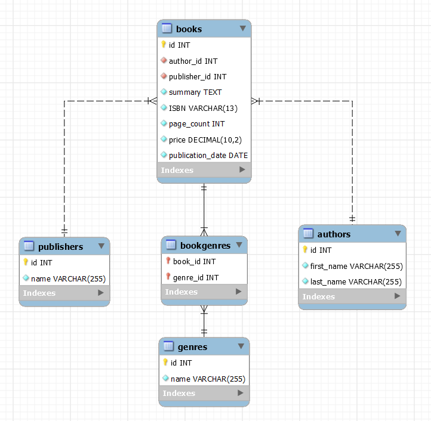

# Base de Datos de Libros

### Tablas

```
CREATE TABLE Authors (
    id INT PRIMARY KEY AUTO_INCREMENT,
    first_name VARCHAR(255) NOT NULL,
    last_name VARCHAR(255) NOT NULL
);

CREATE TABLE Publishers (
    id INT PRIMARY KEY AUTO_INCREMENT,
    name VARCHAR(255) NOT NULL
);

CREATE TABLE Genres (
    id INT PRIMARY KEY AUTO_INCREMENT,
    name VARCHAR(255) NOT NULL
);

CREATE TABLE Books (
    id INT PRIMARY KEY AUTO_INCREMENT,
    author_id INT NOT NULL,
    publisher_id INT NOT NULL,
    summary TEXT NOT NULL,
    ISBN VARCHAR(13) UNIQUE NOT NULL,
    page_count INT NOT NULL,
    price DECIMAL(10,2) NOT NULL,
    publication_date DATE NOT NULL,
    FOREIGN KEY (author_id) REFERENCES Authors(id),
    FOREIGN KEY (publisher_id) REFERENCES Publishers(id)
);

CREATE TABLE BookGenres (
    book_id INT NOT NULL,
    genre_id INT NOT NULL,
    PRIMARY KEY (book_id, genre_id),
    FOREIGN KEY (book_id) REFERENCES Books(id) ON DELETE CASCADE,
    FOREIGN KEY (genre_id) REFERENCES Genres(id) ON DELETE CASCADE
);
```

### Modelo Relacional
