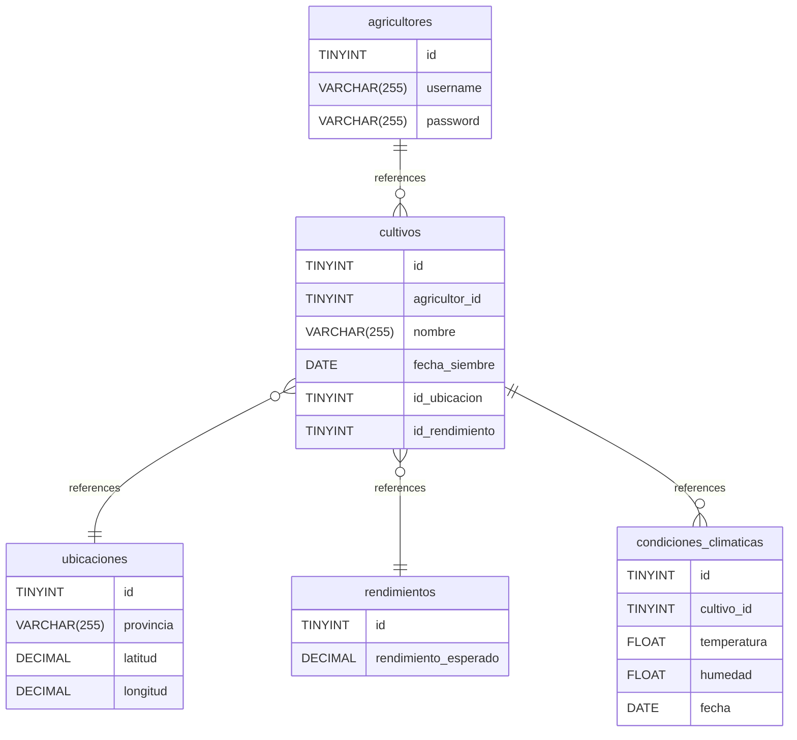

# Diagram ddbb documentation
## Summary

- [Diagram ddbb documentation](#diagram-ddbb-documentation)
  - [Summary](#summary)
  - [Introduction](#introduction)
  - [Database type](#database-type)
  - [Table structure](#table-structure)
    - [agricultores](#agricultores)
    - [cultivos](#cultivos)
    - [condiciones\_climaticas](#condiciones_climaticas)
    - [ubicaciones](#ubicaciones)
    - [rendimientos](#rendimientos)
  - [Relationships](#relationships)
  - [Database Diagram](#database-diagram)

## Introduction

## Database type

- **Database system:** MySQL
## Table structure

### agricultores

| Name        | Type          | Settings                      | References                    | Note                           |
|-------------|---------------|-------------------------------|-------------------------------|--------------------------------|
| **id** | TINYINT | 🔑 PK, not null , unique, autoincrement | fk_agricultores_id_cultivos | |
| **username** | VARCHAR(255) | not null  |  | |
| **password** | VARCHAR(255) | not null  |  | | 

### cultivos

| Name        | Type          | Settings                      | References                    | Note                           |
|-------------|---------------|-------------------------------|-------------------------------|--------------------------------|
| **id** | TINYINT | 🔑 PK, not null , unique, autoincrement | fk_cultivos_id_condiciones_climaticas | |
| **agricultor_id** | TINYINT | not null  |  | |
| **nombre** | VARCHAR(255) | not null  |  | |
| **fecha_siembre** | DATE | not null  |  | |
| **id_ubicacion** | TINYINT | not null  | fk_cultivos_id_ubicacion_ubicaciones | |
| **id_rendimiento** | TINYINT | not null  | fk_cultivos_id_rendimiento_rendimientos | | 

### condiciones_climaticas

| Name        | Type          | Settings                      | References                    | Note                           |
|-------------|---------------|-------------------------------|-------------------------------|--------------------------------|
| **id** | TINYINT | 🔑 PK, not null , unique, autoincrement |  | |
| **cultivo_id** | TINYINT | not null  |  | |
| **temperatura** | FLOAT | not null  |  | |
| **humedad** | FLOAT | not null  |  | |
| **fecha** | DATE | not null  |  | | 

### ubicaciones

| Name        | Type          | Settings                      | References                    | Note                           |
|-------------|---------------|-------------------------------|-------------------------------|--------------------------------|
| **id** | TINYINT | 🔑 PK, not null , unique, autoincrement |  | |
| **provincia** | VARCHAR(255) | not null  |  | |
| **latitud** | DECIMAL | not null  |  | |
| **longitud** | DECIMAL | not null  |  | | 

### rendimientos

| Name        | Type          | Settings                      | References                    | Note                           |
|-------------|---------------|-------------------------------|-------------------------------|--------------------------------|
| **id** | TINYINT | 🔑 PK, not null , unique, autoincrement |  | |
| **rendimiento_esperado** | DECIMAL | not null  |  | | 

## Relationships

- **agricultores to cultivos**: one_to_many
- **cultivos to ubicaciones**: many_to_one
- **cultivos to rendimientos**: many_to_one
- **cultivos to condiciones_climaticas**: one_to_many

## Database Diagram

